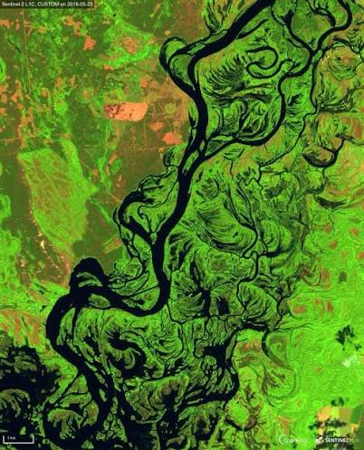
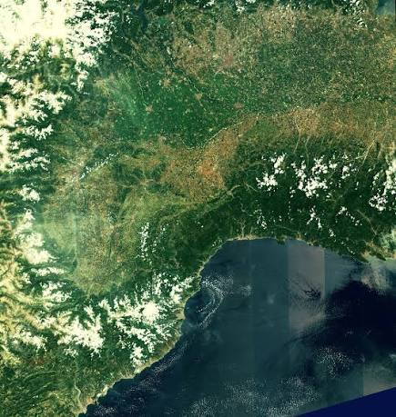

# About Me
Hi there!  
I am a result-oriented professional with a strong interest in evidence-based research on how the built environment influences socioeconomic, environmental, and human interactions in urban ecosystems. Committed to promoting urban resilience, leveraging geospatial technologies and research methods in investigating spatial patterns, land use dynamics, and urban systems. Focused on generating data-driven insights that support sustainable and resilient urban environments amidst growing environmental and demographic pressures. My goal is to connect spatial analysis with planning approaches to improve urban livability and reduce vulnerability to environmental and socio-spatial challenges.

# Education
**Msc. Geographical Information System and Spatial Planning**, University of Porto, Portugal,  [www.up.pt](https://www.up.pt/) (2025 - till date)  

**Ms. Disaster Science and Climate Resilience**, University of Dhaka, Bangladesh, [www.du.ac.bd](https://www.du.ac.bd/)  (2023 - 2024)  

**B.tech Remote Sensing and Geoscience Information System**, Federal University of Technology Akure, Nigeria, [www.futa.edu.ng](https://www.futa.edu.ng/) (2014 - 2018)  
# Research area of Interest
# Publication
# Presentation
# Personal Project
                       
